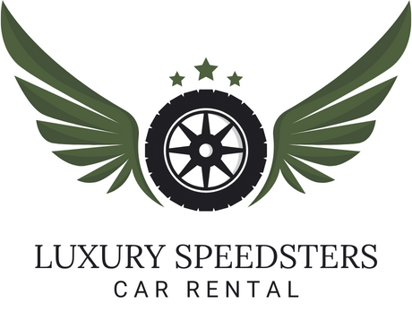

<a name="readme-top"></a>

<div align="center">
  <br/>
  
  <br/>
  <br/>
  <h1><b>Luxury Speedsters</b></h1><a name="about-project"></a>
</div>

<div>
 
</div>

# 📗 Table of Contents

- [📗 Table of Contents](#-table-of-contents)
- [📖🚗 Luxury Speedsters App ](#-luxury-speedsters-app-)
  - [🛠 Built With ](#-built-with-)
    - [Tech Stack ](#tech-stack-)
    - [Key Features ](#key-features-)
  - [🚀 Live Demo ](#-live-demo-)
  - [🎫 Kanban Board ](#-kanban-board-)
  - [💻 Getting Started ](#-getting-started-)
    - [Prerequisites](#prerequisites)
    - [Setup](#setup)
    - [Install](#install)
    - [Usage](#usage)
    - [Run tests](#run-tests)
  - [👥 Authors ](#-authors-)
  - [🔭 Future Features ](#-future-features-)
  - [🤝 Contributing ](#-contributing-)
  - [⭐️ Show your support ](#️-show-your-support-)
  - [🙏 Acknowledgments ](#-acknowledgments-)
  - [❓ FAQ ](#-faq-)
  - [📝 License ](#-license-)

<!-- PROJECT DESCRIPTION -->

# 📖🚗 Luxury Speedsters App <a name="about-project"></a>

Experience the future of automotive luxury with our "Luxury Speedsters" app. Powered by Ruby on Rails for a robust back end and React for an intuitive front end, this app enables users to browse a diverse catalog of cutting-edge vehicles, explore detailed car profiles, and effortlessly create reservations for their dream cars. Keep track of all your reservations in one place, making your journey towards automotive excellence seamless and exciting.

## 🛠 Built With <a name="built-with"></a>

### Tech Stack <a name="tech-stack"></a>

> List of technologies used for this project

<details>
  <summary>BackEnd</summary>
  <ul>
    <li><a href="https://rubyonrails.org">Ruby on Rails</a></li>
    <li><a href="https://stimulus.hotwired.dev/">Stimulus</a></li>
    <li><a href="https://rspec.info/">Rspec</a></li>
  </ul>
</details>

<details>
  <summary>Front-end/View</summary>
  <ul>
    <li><a href="https://react.dev/">React</a></li>
    <li><a href="https://axios-http.com/es/docs/intro">Axios</a></li>
    <li><a href="https://tailwindcss.com/docs/guides/ruby-on-rails">Tailwind CSS</a></li>
  </ul>
</details>

<details>
  <summary>Front-end/Store management</summary>
  <ul>
    <li><a href="https://react-redux.js.org/">React-redux</a></li>
  </ul>
</details>

<details>
  <summary>Database</summary>
  <ul>
    <li><a href="https://www.postgresql.org/">PostgreSQL</a></li>
  </ul>
</details>

<!-- Features -->

### Key Features <a name="key-features"></a>

- **Create and Remove Vehicles**
- **Create Reservations**
- **Full stack webpage**
- **Can see all the list of reservation of current user**
- **Details of every cars in db**
- **Log in and Sign up feature**


<p align="right">(<a href="#readme-top">back to top</a>)</p>


## 🚀 Live Demo <a name="live-demo"></a>

[You can see the Live Demo Here.](https://rentals-app-egry.onrender.com/) 💻📲

<p align="right">(<a href="#readme-top">back to top</a>)</p>

## 🎫 Kanban Board <a name="kanban-board"></a>

- [Link to Kanban Board.](https://github.com/users/Luiscarlosvd/projects/2)
- [Initial state of the Kanban Board.](https://user-images.githubusercontent.com/99110717/269471550-04aefd81-fa1d-439a-8af6-4b714b9de26e.png)
- *We are 4 Team Members.*

<p align="right">(<a href="#readme-top">back to top</a>)</p>


## 💻 Getting Started <a name="getting-started"></a>

To get a local copy up and running, follow these steps.

### Prerequisites

In order to run this project you need:

you need to install ruby 3.2.2 using the prefer tool, example: 
- [rvm](https://rvm.io/)
- [rbenv](https://github.com/rbenv/rbenv)
- [asdf-vm](https://asdf-vm.com/)

- Browser (Google Chrome, Mozilla Firefox, Safari or any other browser)

### Setup

Clone this repository to your desired folder:


```sh
  cd my-folder
  git clone https://github.com/enmanuelbayen/futuristic-transportation.git
```

### Install

Install this project with:


```sh
  cd futuristic-transportation
  bundle install
  npm install
```

### Usage

To run the project, execute the following command:

```sh
./bin/dev
```
**Note:** If there are any errors consider adding your necesary username and password in `database.yml` for setting up your local enviroment and use the following comand:

```sh
rails db:drop db:create db:migrate
./bin/dev
```

### Run tests

To run tests, run the following command:

```sh
rspec
```

<!-- ### Deployment

You can deploy this project using:

<!--
Example:

```sh

```
 -->

<p align="right">(<a href="#readme-top">back to top</a>)</p>

<!-- AUTHORS -->

## 👥 Authors <a name="authors"></a>

👤 **Luis Valera**

- GitHub: [@Luiscarlosvd](https://github.com/Luiscarlosvd)
- Twitter: [@Luiscarlosvd29](https://twitter.com/Luiscarlosvd29)
- LinkedIn: [Luis Valera](https://www.linkedin.com/in/luis-valera-6a5749267/)

👤 **Enmanuel Bayen**

- GitHub: [@enmanuelbayen](https://github.com/enmanuelbayen)
- Twitter: [@EJbayen](https://twitter.com/EJbayen)
- LinkedIn: [LinkedIn](https://www.linkedin.com/in/enmanuel-bayen-torres-480906128/)

👤 **Marco Baquero**

- GitHub: [@mrcbq](https://github.com/mrcbq)
- Twitter: [@mrcbq](https://twitter.com/mrcbq)
- LinkedIn: [mrcbq](https://www.linkedin.com/in/mrcbq/)

👤 **Ignacio Fino**

- GitHub: [@alejuda](https://github.com/Alejuda)
- Twitter: [@nacho_fino](https://twitter.com/nacho_fino)
- LinkedIn: [Ignacio Fino](https://www.linkedin.com/in/ignacio-fino-320916209)
  
<p align="right">(<a href="#readme-top">back to top</a>)</p>

<!-- FUTURE FEATURES -->

## 🔭 Future Features <a name="future-features"></a>

- [ ] **Improve UI**
- [ ] **Add more functionality**
- [ ] **Add More details on Reservation List**

<p align="right">(<a href="#readme-top">back to top</a>)</p>

<!-- CONTRIBUTING -->

## 🤝 Contributing <a name="contributing"></a>

Contributions, issues, and feature requests are welcome!

Feel free to check the [issues page](https://github.com/Luiscarlosvd/futuristic-transportation/issues).

<p align="right">(<a href="#readme-top">back to top</a>)</p>

<!-- SUPPORT -->

## ⭐️ Show your support <a name="support"></a>

If you like this project,please give it a ⭐️!


<p align="right">(<a href="#readme-top">back to top</a>)</p>

<!-- ACKNOWLEDGEMENTS -->

## 🙏 Acknowledgments <a name="acknowledgements"></a>

We would like to thank Microverse for giving us the opportunity to learn and grow as developers and also We like to thank our family, they are all our support. 🌟

> Original design idea by [Murat Korkmaz on Behance.](https://www.behance.net/gallery/26425031/Vespa-Responsive-Redesign)

<p align="right">(<a href="#readme-top">back to top</a>)</p>

<!-- FAQ (optional) -->

## ❓ FAQ <a name="faq"></a>

- **Do I need to install any program before running this project?**

  - [ ] **Yes, you need to install Ruby** 
  
  <br>

- **Can I use this project for my own purposes?**

  - [ ] **Yes, you can.**


<p align="right">(<a href="#readme-top">back to top</a>)</p>

<!-- LICENSE -->

## 📝 License <a name="license"></a>

This project is [MIT](./LICENSE) licensed.


<p align="right">(<a href="#readme-top">back to top</a>)</p>

